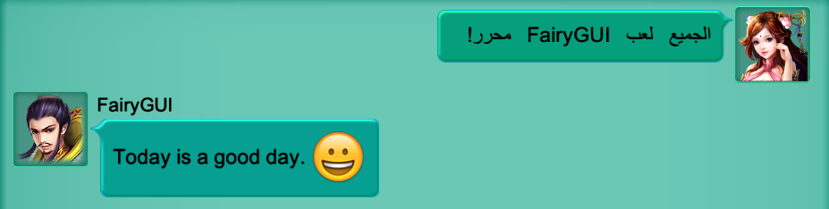

## PaintMode

FairyGUI可以使一个显示对象进入`绘画模式`，简单的说就是将目标对象整体画到一张纹理上，然后就可以操作这个纹理实现一些特殊的效果。以下的功能都依赖这种模式：

- 组件的BlendMode不为默认值“Normal”。
- 对组件使用任意滤镜；
- 对任意对象使用模糊滤镜；
- 组件设置了倾斜；
- 使用了2D模拟3D透视功能，即GObject.perspective = true;
- 曲面UI

绘画模式功能依赖一个额外的相机，以及特别定义的两个Layer。相机是**自动生成**的，名字是CaptureCamera，你不需要访问和操作它。两个Layer的名字是`VUI`和`Hidden VUI`，如果Unity里没有定义这两个Layer，就会出现警告：

```
Please define two layers named 'VUI' and 'Hidden VUI' "
```

这时你要在Layer定义里加上他们，避免出现这个警告。这两个Layer可以随便定义到没使用的层序号（默认是30和31），但要注意所有相机（除了CaptureCamera，它是自动的，不用管）的Culling Mask都**不选择**这两个层。

除了上面提到的功能会使对象进入绘画模式外，也可以调用API手动触发：

```csharp
    //进入绘画模式
    EnterPaintingMode(int requestorId, Margin? margin);

    //离开绘画模式
    LeavePaintingMode(int requestorId);
```

- `requestorId` 请求者id。当多个请求要求显示对象进入绘画模式时，可以用这个id区分。取值是1、2、4、8、16以此类推。1024内内部保留。用户自定义的id从1024开始。
- `margin` 纹理四周的留空。如果特殊处理后的内容大于原内容，那么这里的设置可以使纹理扩大。

**如果目标对象使用了自定义遮罩，则需要额外的设置才能显示正常。**

```csharp
    UIConfig.depthSupportForPaitingMode = true;
```

## 组件截图

使用下面的方法可以实现对组件截图的功能。原理是使用FairyGUI提供的`绘画模式`功能。

```csharp
    GObject aObject;
    DisplayObject dObject = aObject.displayObject;
    dObject.EnterPaintingMode(1024, null);

    //纹理将在本帧渲染后才能更新，所以访问纹理的代码需要延迟到下一帧执行。
    yield return null;

    RenderTexture tex = (RenderTexture)dObject.paintingGraphics.texture.nativeTexture;
    //得到tex后，你可以使用Unity的方法保存为图片或者进行其他处理。具体处理略。

    //处理结束后结束绘画模式。id要和Enter方法的对应。
    dObject.LeavePaintingMode(1024);
```

## 表情显示和输入

FairyGUI支持表情显示和直接输入，即表情图片直接在输入状态下就显示在输入框中，支持PC上的输入，也支持手机原生键盘的输入。例如：


使用办法是为富文本或者输入文本定义emojies集合。

```csharp
    Dictionay<uint, Emoji> emojies = new Dictionary<uint, Emoji>();
    //unicodeValue是字符的unicode编码，imageURL是图片路径
    emojies.Add(unicodeValue, new Emoji(imageURL));

    GRichTextField richTextField;
    richTextField.emojies = emojies;

    GTextInput textInput;
    textInput.emojies = emojies;
```

每个表情对应一个Unicode编码。表情的来源有两种，一是自定义的表情，另外是手机键盘上自带的表情。

对于自定义的表情，你可以用任意字符作为表情的代码，可以选取一些几乎不会被用户直接输入的字符。

对于手机键盘上的表情，一般是使用UCS32编码，即4个字节的Unicode编码。这和我们通常使用的UTF8或者UCS16不同。一般我们在代码里使用的字符，无论是英文还是中文，都可以使用一个char表达，但4字节的Unicode编码在C#需要两个char表达，称为Surrogate Pair。丢掉任何一个char都会造成编码错误。

例如Unicode编码0x1f600对应的表情为：

注册这个表情：

```csharp
    emojies.Add(0x1f600, new Emoji("ui://Emojies/1f600"));
```

IOS上常用的Unicode编码和表情图片资源可以从这里下载：[http://res.fairygui.com/ios-emoji.zip](http://res.fairygui.com/ios-emoji.zip "ios-emoji.zip")

需要注意，0x1f600的Unicode编码在C#里是用两个char表达，即"\U0001f600"，但不代表这两个char的整数值是0x1和0xf600。如果需要对含UCS32编码的文本进行网络传输或者数据库保存，需要确保你的网络层或者数据库接口支持这种编码。可以百度获得这种编码的详细处理方式，关键字是“ios 表情编码”。

UGUI自带的文字组件没有表情的处理，所以Unity屏蔽了表情的输入。如果要打开这个功能，需要修改Xcode项目下/Classes/UI/Keyboard.mm文件，将FILTER_EMOJIS_IOS_KEYBOARD宏修改为0。

## 阿拉伯语言文字显示

FairyGUI支持从右向左的阿拉伯语言文字显示。如果需要打开此功能，使用源码版本的，需要在Unity Player Settings的Scripting Define Symbols里增加RTL_TEXT_SUPPORT；使用DLL版本的，请自行编译包含这个功能的DLL，或者向谷主索取。



## UI自动化测试

FairyGUI提供了自动化测试工具[AirTest](http://airtest.netease.com/)的SDK，方便接入自动化测试。可以从[这里](https://github.com/AirtestProject/Poco-SDK/tree/master/Unity3D)下载使用。使用时要注意在Scripting Define Symbols里填入FAIRYGUI_TEST。
